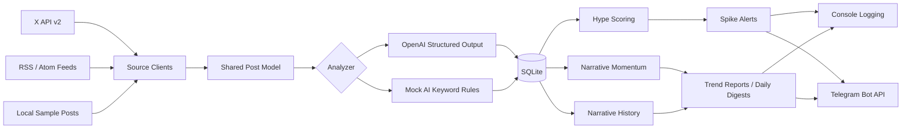

# x-narrative-tracker

Local-first crypto narrative intelligence from X posts and RSS news.

`x-narrative-tracker` collects recent crypto content, extracts tokens and narratives, measures hype and momentum, stores historical signals in SQLite, and delivers actionable Telegram alerts and reports.

The project supports real APIs, public RSS feeds, and a fully local mock-AI workflow for development and evaluation.

## Highlights

- Monitor configured X accounts through an X API v2-compatible client
- Ingest crypto news from configurable RSS and Atom feeds
- Analyze content with OpenAI structured outputs or deterministic mock AI
- Extract tokens, narratives, sentiment, importance, and summaries
- Calculate hype scores and 0-100 Narrative Momentum scores
- Track narrative history, growth, recency, and importance in SQLite
- Send HTML-formatted Telegram spike alerts, summaries, trends, and digests
- Run a complete local MVP without X or OpenAI credentials

## Screenshots

Screenshots are not committed yet. The recommended initial screenshot set is:

| View | Description |
| --- | --- |
| Telegram spike alert | Hype score, confidence, action, top posts, and related narratives |
| Daily digest | Top tokens, narratives, momentum, and important articles |
| Local MVP console | Offline analysis and alert generation |
| Trend report | 24-hour and 7-day narrative rankings |

Place future images in `docs/screenshots/` and reference them here.

## Architecture



## Scoring

### Hype Score

```text
hype score = mentions count * average importance
```

### Narrative Momentum

Narrative Momentum is a bounded `0-100` heuristic combining:

- Mentions during the last 24 hours
- Growth versus the preceding 24-hour period
- Average importance
- Recency of the latest mention

Momentum rankings appear in spike alerts, trend reports, and daily digests.

## Project Structure

```text
app/
  main.py
  config.py
  ai/analyzer.py
  alerts/telegram.py
  db/database.py
  scoring/hype_score.py
  scoring/momentum_score.py
  sources/local_client.py
  sources/rss_client.py
  sources/x_client.py
data/
  accounts.json
  narratives.json
  rss_feeds.json
  sample_posts.json
scripts/
  run_daily_digest.bat
  run_rss_mock.bat
tests/
```

## Requirements

- Python 3.11+
- SQLite with JSON functions
- Internet access for RSS, X, OpenAI, or Telegram integrations

## Setup

Create a virtual environment and install dependencies:

```powershell
python -m venv .venv
.\.venv\Scripts\Activate.ps1
pip install -r requirements.txt
Copy-Item .env.example .env
```

Configure `.env`:

```dotenv
# Required for live X mode
X_BEARER_TOKEN=

# Required for OpenAI analysis; not required with --mock-ai
OPENAI_API_KEY=

# Optional: both values are required to enable Telegram delivery
TELEGRAM_BOT_TOKEN=
TELEGRAM_CHAT_ID=

# Optional application settings
DATABASE_PATH=x_narrative_tracker.sqlite3
OPENAI_MODEL=gpt-4o-mini
FETCH_INTERVAL_SECONDS=900
HYPE_ALERT_THRESHOLD=25
POSTS_PER_ACCOUNT=10
RSS_ARTICLES_PER_FEED=10
```

When Telegram credentials are missing, the application continues normally and logs reports to the console.

## Quick Start

Run the complete offline local MVP:

```powershell
python -m app.main --mode local --reset-db --summary
```

This command reads 30 sample posts, performs deterministic analysis, stores results in SQLite, calculates scores, prints alerts, and produces a summary.

## Source Modes

### Local Mode

Local mode requires no X or OpenAI credentials:

```powershell
python -m app.main --mode local
```

Useful options:

```powershell
python -m app.main --mode local --reset-db
python -m app.main --mode local --summary
python -m app.main --mode local --no-telegram
```

### RSS Mode

RSS mode reads public feeds from `data/rss_feeds.json` and runs continuously using the configured polling interval:

```powershell
python -m app.main --mode rss
```

RSS mode requires `OPENAI_API_KEY` unless mock AI is enabled.

Example feed configuration:

```json
{
  "RSS_FEEDS": [
    {
      "name": "CoinDesk",
      "url": "https://www.coindesk.com/arc/outboundfeeds/rss/"
    }
  ]
}
```

Each feed is isolated: an unavailable or malformed feed is logged without stopping the remaining sources.

### X Mode

Configure usernames in `data/accounts.json`, then run:

```powershell
python -m app.main --mode live
```

Live mode requires `X_BEARER_TOKEN` and, unless mock AI is enabled, `OPENAI_API_KEY`.

## Mock AI Mode

Mock AI uses local keyword rules instead of OpenAI:

```powershell
python -m app.main --mode rss --mock-ai
python -m app.main --mode live --mock-ai
```

It detects common tokens and configured narrative aliases, then generates sentiment, importance, spike explanations, confidence, and suggested actions. The database, alerts, momentum, and report pipeline remains identical.

Mock AI removes OpenAI dependency, but RSS and X modes still require network access to their respective sources.

### Mock AI Limitations

Mock AI is designed for fast, deterministic classification rather than language-level understanding:

- It relies on keyword and ticker matches, so implied narratives without recognizable terms may be missed.
- Ambiguous tickers such as `OP`, `TON`, `NEAR`, and `LINK` are detected when uppercase, prefixed with `$`, or referenced by project name to reduce false positives.
- Sentiment and importance are lexical heuristics and do not understand sarcasm, source credibility, or market context.
- Narrative mappings are intentionally broad. For example, macroeconomic terms map to `Bitcoin / macro` even when an article is not exclusively about Bitcoin.
- OpenAI mode remains the better option for nuanced classification, summaries, and explanations.

The canonical mock-AI taxonomy includes Bitcoin/macro, Ethereum/L2, Solana, AI agents, DePIN, RWA, memecoins, gaming, stablecoins, ETFs, regulation, privacy, DeFi, and infrastructure.

## Reports

Generate a narrative trend report from stored history:

```powershell
python -m app.main --trend-report
```

The report includes:

- Top narratives over the last 24 hours
- Top narratives over the last 7 days
- Fastest-growing narratives
- Narrative Momentum rankings

Generate a daily digest:

```powershell
python -m app.main --daily-digest
```

The digest includes:

- Top five tokens from the last 24 hours
- Top five narratives from the last 24 hours
- Fastest-growing narrative
- Top three most important posts or articles
- Narrative Momentum rankings
- Short closing summary

Reports are sent to Telegram automatically when credentials are configured. Add `--no-telegram` for console-only output.

Generate a seven-day Narrative Momentum comparison:

```powershell
python -m app.main --history-report
```

Every processing run upserts one momentum snapshot per narrative for the current UTC date in the `daily_momentum` SQLite table. The history report compares today's score with the latest available snapshot on or before seven days ago.

Rank the strongest narrative opportunities from stored momentum history:

```powershell
python -m app.main --top-opportunities
```

Opportunity rankings combine latest momentum, seven-day growth, and snapshot recency. Results are classified as `Emerging`, `Growing`, or `Watchlist` and are sent to Telegram when configured.

## Telegram Examples

### Hype Spike

```text
Crypto Hype Spike

Token/Narrative: SOL
Hype Score: 36.00
Confidence: 8/10
Action: research

Why it matters:
SOL is appearing across several high-importance posts.

Top posts:
1. @account: SOL activity continues to grow...

Narrative Momentum:
Solana ecosystem 92
```

### Daily Digest

```text
Crypto Daily Digest

Top 5 tokens last 24h
1. SOL - hype score 36.00

Fastest growing narrative
AI Agents +42%

Narrative Momentum
AI Agents 92
RWA 61
Memecoins 47
```

Telegram messages use HTML formatting and escape dynamic content before delivery.

## Windows Task Scheduler

The included batch scripts change to the project directory before running.

Test them manually:

```powershell
scripts\run_rss_mock.bat
scripts\run_daily_digest.bat
```

### RSS Mock Tracker

Create a Task Scheduler task with:

- Program: `<PROJECT_DIR>\scripts\run_rss_mock.bat`
- Trigger: daily, repeating every 15 minutes indefinitely
- Existing instance rule: **Do not start a new instance**
- Setting: **Run task as soon as possible after a scheduled start is missed**

RSS mode remains active and performs its own 15-minute polling loop.

### Daily Digest

Create a second task with:

- Program: `<PROJECT_DIR>\scripts\run_daily_digest.bat`
- Trigger: daily at the preferred morning time
- Setting: **Run task as soon as possible after a scheduled start is missed**

## Testing

Run the test suite:

```powershell
python -m unittest discover -s tests
```

Tests cover:

- RSS and Atom parsing
- Mock AI token, narrative, and sentiment detection
- Narrative history and growth calculations
- Narrative Momentum scoring
- Telegram formatting, HTML escaping, and payloads

## Data and Operations

- SQLite is created automatically at `DATABASE_PATH`.
- Existing posts are skipped using their stable source IDs.
- Spike alerts are de-duplicated for the same signal within 60 minutes.
- Narrative score snapshots are stored after each processing run.
- `--reset-db` clears analyses, alerts, and narrative history.
- Individual post-analysis, feed, OpenAI, and Telegram errors are logged without silently failing.

## Roadmap

- [ ] Add a web dashboard for narratives, tokens, and source activity
- [ ] Add configurable scoring weights and time windows
- [ ] Add source-level reliability and influence weighting
- [ ] Add semantic clustering for emerging narratives
- [ ] Add historical charts and momentum sparklines
- [ ] Add PostgreSQL support for larger deployments
- [ ] Add Docker and cross-platform service definitions
- [ ] Add scheduled report configuration and multiple Telegram destinations
- [ ] Add integration tests against recorded API fixtures
- [ ] Add packaging, release automation, and a project license

## Disclaimer

This project is an experimental monitoring and research tool. Scores, summaries, and suggested actions are heuristic outputs and are not financial advice.
