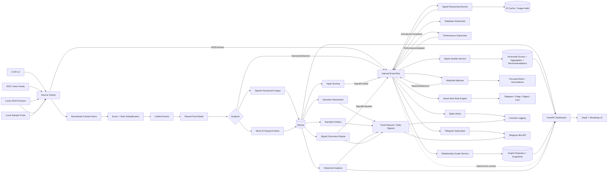

# x-narrative-tracker

Local-first crypto narrative intelligence from X posts and RSS news.

`x-narrative-tracker` collects recent crypto content, extracts tokens and narratives, measures hype and momentum, stores historical signals in SQLite, and delivers actionable Telegram alerts and reports.

The project supports real APIs, public RSS feeds, and a fully local mock-AI workflow for development and evaluation.

## Highlights

- Monitor configured X accounts through an X API v2-compatible client
- Ingest crypto news from configurable RSS, Atom, generic feed, and local JSON sources
- Canonicalize URLs and merge exact or near-duplicate reporting into unified events
- Analyze content with OpenAI structured outputs or deterministic mock AI
- Add evidence-grounded OpenAI reasoning to qualified signals with safe fallback
- Extract tokens, narratives, sentiment, importance, and summaries
- Calculate hype scores and 0-100 Narrative Momentum scores
- Track narrative history, growth, recency, and importance in SQLite
- Send HTML-formatted Telegram spike alerts, summaries, trends, and digests
- Explore signals and performance in the built-in FastAPI analytics dashboard
- Route new signals through configurable smart alert rules
- Explore deterministic token, narrative, event, source, watchlist, and rule relationships
- Score signal evidence, calibration, reliability, timeliness, noise, and evaluation coverage
- Run a complete local MVP without X or OpenAI credentials

## Screenshots

### Analytics Dashboard


The dashboard presents system health, latest signals, evaluated accuracy, momentum, top narratives, and top tokens from the existing SQLite database.

### Narrative Relationship Graph


The graph explorer keeps observed evidence distinct from AI-suggested relationships and supports period, type, weight, occurrence, watchlist, and search filters.

## Architecture


```mermaid
flowchart LR
    X["X API v2"] --> Sources["Source Clients"]
    RSS["RSS / Atom Feeds"] --> Sources
    JSON["Local JSON Fixtures"] --> Sources
    Local["Local Sample Posts"] --> Sources

    Sources --> Normalize["Normalized Content Items"]
    JSON --> Sources
    Normalize --> Dedupe["Exact + Near Deduplication"]
    Dedupe --> Events["Unified Events"]
    Events --> Posts["Shared Post Model"]
    Sources -->|RSSFetched| Bus["Internal Event Bus"]
    Posts --> Analyzer{"Analyzer"}
    Analyzer --> OpenAI["OpenAI Structured Output"]
    Analyzer --> MockAI["Mock AI Keyword Rules"]

    OpenAI --> DB[("SQLite")]
    MockAI --> DB
    Analyzer -->|NarrativeDetected| Bus

    DB --> Hype["Hype Scoring"]
    DB --> Momentum["Narrative Momentum"]
    DB --> History["Narrative History"]
    DB --> Historical["Historical Analytics"]
    DB --> Outcomes["Signal Outcomes Engine"]
    DB --> Dashboard["FastAPI Dashboard"]

    Hype -->|SignalCreated| Bus
    Bus --> Reasoning["Signal Reasoning Service"]
    Reasoning -->|AIAnalysisCompleted| Bus
    Reasoning --> AICache[("AI Cache / Usage Audit")]
    Outcomes -->|SignalEvaluated| Bus
    Bus --> Storage["Database Subscriber"]
    Bus --> Performance["Performance Subscriber"]
    Bus --> Telegram["Telegram Subscriber"]
    Bus --> Rules["Smart Alert Rule Engine"]
    Bus --> Watchlists["Watchlist Matcher"]
    Bus --> Graph["Relationship Graph Service"]
    Bus --> Quality["Signal Quality Service"]
    Graph --> GraphDB[("Graph Projection + Snapshots")]
    Quality --> QualityDB[("Versioned Scores + Aggregates + Recommendations")]
    QualityDB --> Dashboard
    GraphDB --> Dashboard
    Watchlists -->|WatchlistMatched| Bus
    Watchlists --> Focused["Focused Alerts / Associations"]
    Rules --> RuleActions["Telegram / Flags / Digest / CSV"]
    Performance -->|PerformanceUpdated| Bus
    Bus -. Optional live events .-> Dashboard

    Bus --> Alerts["Spike Alerts"]
    Momentum --> Reports["Trend Reports / Daily Digests"]
    History --> Reports
    Historical --> Reports
    Historical --> Dashboard
    Outcomes --> Reports

    Alerts --> Console["Console Logging"]
    Telegram --> TelegramAPI["Telegram Bot API"]
    Reports --> Console
    Reports --> TelegramAPI
    Dashboard --> Browser["Jinja2 + Bootstrap UI"]
```

### Internal Event Flow

The application uses a synchronous, typed, in-process event bus with no external dependencies. Publishers call `publish(event)`, while components register handlers with `subscribe(event_type, handler)`. Handlers run in registration order during the same process, keeping the MVP deterministic and easy to test.

| Event | Published when | Current consumers |
| --- | --- | --- |
| `RSSFetched` | An RSS cycle returns shared posts | Extension point for source telemetry |
| `NarrativeDetected` | Analysis detects a narrative in a post | Extension point for dashboards and APIs |
| `SignalCreated` | Hype evaluation creates an alert | SQLite alert storage, performance tracking, smart rules, Telegram |
| `WatchlistMatched` | A saved signal matches one or more enabled watchlists | Dashboard event state and future focused-alert adapters |
| `SignalEvaluationRequested` | A configured evaluation window becomes eligible for processing | Outcome evaluator observability and future workers |
| `SignalEvaluated` | The outcomes engine evaluates a mature signal | SQLite outcome storage, performance updates |
| `PerformanceUpdated` | Signal or outcome performance changes | Extension point for dashboards and REST APIs |
| `AIAnalysisRequested` | A saved signal qualifies for reasoning | Usage observability and future workers |
| `AIAnalysisCompleted` | Structured reasoning is persisted | AI-aware rules and the original Telegram alert |
| `AIAnalysisFailed` | OpenAI fails after bounded retries | Operational observability |
| `AIAnalysisFallbackUsed` | Deterministic fallback replaces OpenAI | Operational observability |
| `ContentFetched` | A configured source fetch completes | Source telemetry and health |
| `ContentAccepted` | A unique normalized item is retained | Unified-event creation |
| `ContentDeduplicated` | Exact or near duplicate evidence is linked | Deduplication audit surfaces |
| `UnifiedEventCreated` | First evidence creates a canonical event | Future API and dashboard adapters |
| `UnifiedEventUpdated` | Supporting evidence is added | Event metrics and timelines |
| `UnifiedEventMateriallyChanged` | Coverage, score, or conflicts cross configured thresholds | Telegram update notifications |
| `SourceFetchFailed` / `SourceRecovered` | Source health changes | Thresholded Telegram health alerts |
| `GraphUpdated` | An incremental graph projection changes | Dashboard/API extension point |
| `EmergingRelationshipDetected` | A relationship crosses the accelerating threshold | Alerting and analytics extension point |
| `GraphSnapshotCreated` | A daily, weekly, or monthly snapshot is persisted | Historical graph analytics extension point |
| `SignalQualityCalculated` | A versioned explainable signal score is saved | Quality-aware rules and dashboard refresh state |
| `QualityAggregateUpdated` | An entity-period quality aggregate is saved | Reporting and future automation adapters |
| `QualityDegradationDetected` / `QualityImprovementDetected` | Equivalent periods differ beyond the configured significance | Operational observability |
| `QualityRecommendationCreated` | A deterministic quality issue is first persisted for a period | Recommendation workflow adapters |

The bus is intentionally transport-neutral. Future Dashboard, REST API, websocket, or audit-log adapters can subscribe without changing scoring and analysis code. Existing public helpers remain callable without supplying a bus; they create and register the default subscribers automatically.

## Scoring

### Hype Score

```text
hype score = mentions count * average importance
```

The raw hype score remains internal and is only emitted in debug logs. User-facing reports show a normalized display score from `0-100`.

Example:

```text
raw score = 116
display score = 92/100
```

Display score interpretation:

| Score | Meaning |
| --- | --- |
| 0-20 | Low |
| 21-40 | Moderate |
| 41-60 | Strong |
| 61-80 | High |
| 81-100 | Extreme |

### Narrative Momentum

Narrative Momentum is a bounded `0-100` heuristic combining:

- Mentions during the last 24 hours
- Growth versus the preceding 24-hour period
- Average importance
- Recency of the latest mention

Momentum rankings appear in spike alerts, trend reports, and daily digests.

## Narrative Relationship Graph

The graph is a derived projection over existing SQLite records. It never creates a separate analytics database and does not duplicate article bodies. `GraphService` incrementally consumes signals, unified events, source evidence, watchlist associations, triggered rules, AI analyses, and outcomes through the existing repositories and Event Bus. `--graph-rebuild` explicitly recreates only the projection and preserves source records, signals, events, rules, and watchlists.

### Nodes And Edges

Supported node types are `narrative`, `token`, `unified_event`, `source`, `watchlist`, and `rule`. Tokens use canonical uppercase symbols and known aliases such as Bitcoin to `BTC`; narrative identity is case-insensitive and whitespace-normalized without fuzzy semantic merging.

Supported edge types are:

- `narrative_mentions_token`
- `narrative_related_to_narrative`
- `event_contains_narrative`
- `event_mentions_token`
- `source_reports_event`
- `watchlist_tracks_token`
- `watchlist_tracks_narrative`
- `rule_triggered_by_event`
- `rule_matches_watchlist`
- `token_co_occurs_with_token`

Narrative-to-narrative and token co-occurrence edges are undirected and stored in deterministic node-ID order. Every evidence key is retained once, so replaying the same event does not increase occurrence counts. AI-derived edges use `derivation=ai`, retain model confidence, require `GRAPH_AI_RELATIONSHIP_MIN_CONFIDENCE`, and never overwrite an observed edge.

### Weighting And Decay

All graph scores are deterministic and bounded. Edge weight uses:

```text
evidence  = min(1, log(1 + occurrences) / log(11))
diversity = min(1, (unique sources + unified events) / 8)
quality   = average(hype/100, momentum/100, confidence/10,
                    outcome success rate/100, priority/100)
base      = 0.45 * evidence + 0.20 * diversity + 0.35 * quality
AI edge   = 0.65 * base + 0.35 * AI confidence
weight    = base * 0.5 ^ (age days / GRAPH_RECENCY_HALF_LIFE_DAYS)
```

Node weight combines 65% connectivity, using `1 - exp(-weighted_degree / 3)`, with 35% activity and the same recency decay. Decay is recalculated when graph views are read, so old relationships become less prominent without deleting history. `GRAPH_MIN_EDGE_WEIGHT` and `GRAPH_MIN_NODE_WEIGHT` control default presentation thresholds.

Emerging relationship score combines recent occurrence growth (30%), source diversity (20%), event diversity (15%), hype (15%), momentum (10%), and recency (10%). Scores at least 75 are `accelerating`; scores at least 55 with two observations are `emerging`; lower recent scores are `stable`; decayed or contracting evidence is `weakening` or `inactive`. Snapshot baselines make growth comparisons deterministic.

Bridge score rewards a token or narrative whose neighbors occupy otherwise disconnected groups, then adds bounded connected-entity and source-diversity evidence. Node details expose connected clusters, supporting events, centrality, degree, weighted degree, and outcome continuation statistics. These associations show correlation and shared attention, not causation or profitability.

### Graph Commands

```powershell
python -m app.main --graph-summary
python -m app.main --graph-node token SOL
python -m app.main --graph-top-narratives
python -m app.main --graph-top-tokens
python -m app.main --graph-emerging
python -m app.main --graph-bridges
python -m app.main --graph-snapshot daily
python -m app.main --graph-snapshot weekly
python -m app.main --graph-snapshot monthly
python -m app.main --graph-rebuild
python -m app.main --graph-validate
```

Snapshot creation is idempotent for each calendar period. Validation reports missing nodes, duplicate or reversed deterministic edges, invalid types, out-of-range weights/confidence, orphaned references, and inconsistent snapshot dates without modifying data.

### Dashboard And API

Start the dashboard with `python -m app.main --dashboard`. Use `/graph` for the bounded Cytoscape.js explorer, `/graph/nodes/{node_type}/{entity_id}` for evidence and history, `/graph/emerging` for changing relationships, `/graph/bridges` for cross-cluster entities, and `/graph/analytics` for distributions and snapshots. The visualization pins Cytoscape.js `3.30.4`, visually distinguishes node types, sizes nodes by weight, sizes edges by weight, and uses dashed lines for AI-derived evidence.

REST endpoints are `GET /api/graph`, `GET /api/graph/nodes`, `GET /api/graph/nodes/{node_type}/{entity_id}`, `GET /api/graph/edges`, `GET /api/graph/summary`, `GET /api/graph/emerging`, `GET /api/graph/bridges`, `GET /api/graph/snapshots`, `POST /api/graph/snapshots`, `POST /api/graph/rebuild`, and `GET /api/graph/validate`. Query limits are validated and graph responses are capped by `GRAPH_MAX_NODES`.

Known limitations: centrality and bridge metrics are lightweight heuristics rather than full academic graph algorithms; emerging status depends on accumulated tracker evidence; AI suggestions can still be incomplete despite confidence filtering; and no relationship predicts guaranteed market or token-price performance.

## Project Structure

```text
app/
  main.py
  config.py
  analytics/historical.py
  ai/analyzer.py
  ai/base.py
  ai/factory.py
  ai/models.py
  ai/mock_analyzer.py
  ai/openai_analyzer.py
  ai/service.py
  alerts/telegram.py
  db/database.py
  dashboard/app.py
  dashboard/service.py
  dashboard/static/
  dashboard/templates/
  events/bus.py
  events/models.py
  events/subscribers.py
  export/csv_exporter.py
  graph/models.py
  graph/service.py
  graph/weights.py
  rules/engine.py
  rules/models.py
  watchlists/models.py
  watchlists/service.py
  scoring/hype_score.py
  scoring/momentum_score.py
  scoring/signal_outcomes.py
  sources/local_client.py
  sources/rss_client.py
  sources/x_client.py
data/
  accounts.json
  narratives.json
  rss_feeds.json
  sample_posts.json
scripts/
  run_daily_digest.bat
  run_rss_mock.bat
tests/
```

## Requirements

- Python 3.11+
- SQLite with JSON functions
- Internet access for RSS, X, OpenAI, or Telegram integrations

## Setup

Create a virtual environment and install dependencies:

```powershell
python -m venv .venv
.\.venv\Scripts\Activate.ps1
pip install -r requirements.txt
Copy-Item .env.example .env
```

Configure `.env`:

```dotenv
# Required for live X mode
X_BEARER_TOKEN=

# Required for OpenAI analysis; not required with --mock-ai
OPENAI_API_KEY=

# Optional: both values are required to enable Telegram delivery
TELEGRAM_BOT_TOKEN=
TELEGRAM_CHAT_ID=

# Optional application settings
DATABASE_PATH=x_narrative_tracker.sqlite3
OPENAI_MODEL=gpt-4o-mini
FETCH_INTERVAL_SECONDS=900
HYPE_ALERT_THRESHOLD=25
POSTS_PER_ACCOUNT=10
RSS_ARTICLES_PER_FEED=10
OUTCOME_EVALUATION_HOURS=24
OUTCOME_EVALUATION_WINDOWS=24,72,168
OUTCOME_SUCCESS_THRESHOLD=10
OUTCOME_FAILURE_THRESHOLD=-10
HISTORY_GROWTH_THRESHOLD=20
HISTORY_MINIMUM_ACTIVITY=2
AI_PROVIDER=mock
OPENAI_TIMEOUT_SECONDS=30
OPENAI_MAX_RETRIES=1
OPENAI_MAX_OUTPUT_TOKENS=700
OPENAI_MAX_POST_LENGTH=600
OPENAI_MIN_HYPE_SCORE=65
OPENAI_MIN_MOMENTUM_SCORE=50
OPENAI_MIN_CONFIDENCE=6
OPENAI_DAILY_REQUEST_LIMIT=100
OPENAI_CACHE_TTL_HOURS=24
OPENAI_FALLBACK_TO_MOCK=true
OPENAI_STORE_RESPONSES=false
GRAPH_RECENCY_HALF_LIFE_DAYS=14
GRAPH_MIN_EDGE_WEIGHT=0.05
GRAPH_MIN_NODE_WEIGHT=0.05
GRAPH_AI_RELATIONSHIP_MIN_CONFIDENCE=0.75
GRAPH_DEFAULT_PERIOD_DAYS=30
GRAPH_MAX_NODES=250
```

When Telegram credentials are missing, the application continues normally and logs reports to the console.

## OpenAI Signal Reasoning

Signal reasoning is a second-stage analysis of a saved hype signal. It uses the signal's token and narrative, normalized hype and momentum, mention count, tracker confidence, up to three deduplicated source excerpts, watchlist matches, rule matches, related entities, and recent outcome history. The result is stored separately from the original post classification:

- Summary and why the signal matters
- Action: `ignore`, `monitor`, `research`, or `high_priority_research`
- Confidence from 1 to 10 and risk level
- Supporting factors, risk factors, market context, and invalidation conditions
- Related tokens and narratives

Provider modes:

| `AI_PROVIDER` | Behavior |
| --- | --- |
| `mock` | Always use deterministic local reasoning. OpenAI is never called. This is the default. |
| `openai` | Use OpenAI for eligible signals; use mock fallback when configured. |
| `auto` | Use OpenAI when a key is available and the signal qualifies, otherwise use mock. |

OpenAI eligibility requires all three configured minimums: hype, momentum, and tracker confidence. A watchlist match or a high-priority rule overrides those minimums. `--analyze-signal ID` is a manual override. `--mock-ai` also forces signal reasoning to remain local.

Evaluation order is deterministic: save the signal, associate enabled watchlists, evaluate non-AI rules, apply watchlist/high-priority overrides, check the three minimum thresholds, select the configured provider, check persisted results and cache, enforce the UTC daily limit, run bounded provider attempts, persist the result, evaluate AI-aware rules, then construct the single Telegram alert.

```powershell
python -m app.main --ai-status
python -m app.main --analyze-signal 42
python -m app.main --clear-ai-cache
```

The integration uses the official OpenAI Python SDK and Responses structured outputs validated by typed Pydantic models. Transient rate-limit, timeout, and network failures receive bounded retries. Authentication and invalid-output failures do not retry indefinitely. The local daily request limit counts non-cached OpenAI attempts, and deterministic cache keys include the model, prompt version, and normalized evidence context.

Create an API key in the OpenAI platform, place it only in your local `.env` as `OPENAI_API_KEY`, and set `AI_PROVIDER=openai` or `auto`. Never commit `.env`, paste keys into rules or source posts, or expose them through dashboard configuration. The request threshold, cache TTL, maximum excerpt length, output limit, and daily cap help control usage. The daily cap is a local guardrail rather than a provider billing control; monitor provider usage separately and choose `mock` during development and CI.

The API exposes `GET /api/ai/status`, `GET /api/ai/usage`, `GET /api/ai/analyses`, and `GET` or `POST /api/signals/{id}/analysis`. The dashboard adds an AI usage page and an AI reasoning section on signal details. Smart rules may use `ai_action`, `ai_confidence`, `ai_risk_level`, `openai_analysis_available`, and `ai_fallback_used` after analysis completes.

### Privacy And Safety

Source excerpts are treated as untrusted quoted data. The system prompt explicitly rejects instructions found in posts, forbids invented prices, partnerships, announcements, and market facts, and frames outputs as research rather than financial advice. Inputs are bounded to three short excerpts. The usage audit stores provider, model, timing, sizes, cache/fallback state, token counts when available, and sanitized error types; it does not store API keys, authorization headers, raw prompts, or full provider responses. `OPENAI_STORE_RESPONSES` defaults to `false`.

The reasoning measures evidence and narrative continuation in tracker data. It does not predict token prices or establish profitability. Mock fallback is deterministic and useful for continuity, but it is not equivalent to language-model judgment.

## Quick Start

Run the complete offline local MVP:

```powershell
python -m app.main --mode local --reset-db --summary
```

This command reads 30 sample posts, performs deterministic analysis, stores results in SQLite, calculates scores, prints alerts, and produces a summary.

## Analytics Dashboard

Start the built-in dashboard against the SQLite database configured by `DATABASE_PATH`:

```powershell
python -m app.main --dashboard
```

Open [http://127.0.0.1:8000](http://127.0.0.1:8000). Use another host or port when needed:

```powershell
python -m app.main --dashboard --dashboard-host 0.0.0.0 --dashboard-port 8080
```

The dashboard reads analytics from SQLite and provides these pages:

- `/` overview
- `/signals` latest signals and outcomes
- `/performance` accuracy, confidence, momentum, and narrative results
- `/outcomes` filterable signal outcome history and metric changes
- `/history` period comparisons, classifications, timelines, and entity details
- `/narratives` 24-hour narrative rankings
- `/tokens` 24-hour token rankings
- `/rules` smart alert rule management and rule details
- `/watchlists` focused-alert groups, settings, matching signals, and outcomes
- `/graph` interactive relationship explorer
- `/graph/emerging` and `/graph/bridges` relationship rankings
- `/graph/analytics` aggregate metrics and snapshots

JSON endpoints are available for signals, performance, outcomes, historical analytics, narratives, tokens, rules, and system status. Pages poll analytics endpoints every 30 seconds, so collector and dashboard processes can share the same SQLite file without restarting the web server. The Outcomes page filters by status, evaluation window, token, and narrative. The History page selects `7d`, `30d`, `90d`, or `all` and links to narrative and token detail views.

The app factory accepts an optional `EventBus`, allowing an embedded dashboard to subscribe to `PerformanceUpdated` and `NarrativeDetected`. The standard CLI deployment remains database-driven so it also works as a separate process.

Signals, Outcomes, and Historical Analytics can be filtered by watchlist. The dashboard and management APIs have no authentication. Keep the default localhost binding unless access is protected by a trusted reverse proxy or private network.

## Smart Alert Rules

Every `SignalCreated` event is evaluated against enabled rules after the signal is saved. Rules run synchronously in descending priority order. A match is persisted once per rule and signal, updates `last_triggered` and `trigger_count`, and executes its configured actions. Existing signal publishers are unchanged.

Conditions are JSON expression trees. `AND` and `OR` accept non-empty arrays; `NOT` accepts one expression. Comparison leaves use `field`, `operator`, and `value`:

```json
{
  "AND": [
    {"field": "narrative", "operator": "contains", "value": "AI"},
    {"field": "hype_score", "operator": ">=", "value": 80},
    {"NOT": {"field": "token", "operator": "eq", "value": "BTC"}}
  ]
}
```

Supported fields are `token`, `narrative`, `hype_score`, `momentum_score`, `confidence`, `mentions`, `outcome_success_rate`, `watchlist`, `watchlist_id`, `watchlist_priority`, `matched_watchlist`, `node_degree`, `weighted_degree`, `bridge_score`, `emerging_relationship_score`, `source_diversity`, `connected_narrative_count`, and `connected_token_count`. Text supports `eq`, `ne`, `contains`, and `in`; numeric fields support `eq`, `ne`, `gt`, `gte`, `lt`, `lte`, `in`, and the symbol aliases `==`, `!=`, `>`, `>=`, `<`, `<=`. Text comparisons are case-insensitive. Outcome success rate is the percentage of saved successful outcomes for matching token or narrative signals; it is `0` while no evaluated outcomes exist.

Actions:

- `telegram` sends an additional HTML-formatted smart-rule notification when Telegram is configured.
- `high_priority` marks the signal as high priority.
- `dashboard_highlight` highlights the signal in dashboard tables.
- `include_in_digest` adds the signal name to the daily digest smart-rule watchlist.
- `csv_export_marker` writes `1` in the signal CSV marker column.

Create and manage rules from `/rules`, the REST API, or the CLI:

```powershell
python -m app.main --create-rule "Extreme AI" `
  --rule-condition '{"AND":[{"field":"narrative","operator":"contains","value":"AI"},{"field":"hype_score","operator":">=","value":80}]}' `
  --rule-actions telegram,high_priority,dashboard_highlight `
  --rule-priority 100

python -m app.main --list-rules
python -m app.main --disable-rule 1
python -m app.main --enable-rule 1
python -m app.main --test-rule 1 --signal-json '{"narrative":"AI agents","hype_score":84,"confidence":8}'
python -m app.main --delete-rule 1
```

`--test-rule` is a dry run: it does not execute actions or change trigger counters. Without `--signal-json`, it evaluates the latest saved signal.

REST endpoints:

```text
GET    /api/rules
POST   /api/rules
PUT    /api/rules/{id}
DELETE /api/rules/{id}
```

Example POST body:

```json
{
  "name": "Extreme AI",
  "enabled": true,
  "priority": 100,
  "condition": {"field": "momentum_score", "operator": ">=", "value": 80},
  "action": ["telegram", "dashboard_highlight"]
}
```

## Watchlists and Focused Alerts

Watchlists are named token and narrative collections evaluated for every `SignalCreated` event. Enabled watchlists can require minimum hype, momentum, and confidence values. A matching signal is associated once with each matching item, and one aggregate `WatchlistMatched` event is published even when several watchlists match. The regular signal flow remains unchanged.

Token matching is always case-insensitive and strips a leading `$`. Narrative matching collapses repeated whitespace and uses normalized exact matching; it is case-insensitive by default. Fuzzy and substring matching are intentionally not used.

Create a portfolio and add items:

```powershell
python -m app.main --create-watchlist "Main Portfolio" --watchlist-priority 8 --watchlist-minimum-hype 75
python -m app.main --add-watchlist-token "Main Portfolio" BTC
python -m app.main --add-watchlist-token "Main Portfolio" ETH
python -m app.main --add-watchlist-token "Main Portfolio" SOL
python -m app.main --add-watchlist-narrative "AI Narratives" "AI Agents"
python -m app.main --list-watchlists
python -m app.main --watchlist-report "Main Portfolio"
```

Management commands also include `--enable-watchlist`, `--disable-watchlist`, `--remove-watchlist-item`, and `--delete-watchlist`. Creation settings include `--watchlist-description`, `--watchlist-minimum-momentum`, `--watchlist-minimum-confidence`, `--watchlist-no-telegram`, `--watchlist-include-digest`, `--watchlist-no-highlight`, and `--watchlist-case-sensitive`.

Telegram supports `/watchlists` and `/watchlist <name>`. A normal spike alert contains one escaped Watchlists section listing all eligible matches; it never sends one copy per matching watchlist.

REST endpoints:

```text
GET    /api/watchlists
POST   /api/watchlists
GET    /api/watchlists/{id}
PUT    /api/watchlists/{id}
DELETE /api/watchlists/{id}
POST   /api/watchlists/{id}/items
DELETE /api/watchlists/{id}/items/{item_id}
GET    /api/watchlists/{id}/signals
GET    /api/watchlists/{id}/performance
GET    /api/watchlists/{id}/history
```

Example workflow: create `Main Portfolio`, add BTC, ETH, and SOL, create a smart rule combining `watchlist = "Main Portfolio"` with `hype_score >= 75`, run RSS mode, then review the single focused alert in Telegram and the Watchlist Details dashboard page. Watchlist outcomes measure signal continuation in tracker data, not token price profitability.

## Source Modes

### Multi-source ingestion

RSS mode now reads `config/sources.json`. Each entry has a stable `id`, display `name`, `type` (`rss`, `atom`, `feed`, or `local_json`), URL/path, enabled state, `0-10` priority, categories, and fetch interval. Invalid entries are logged and skipped without disabling healthy sources.

```json
[
  {
    "id": "coindesk",
    "name": "CoinDesk",
    "type": "rss",
    "url": "https://www.coindesk.com/arc/outboundfeeds/rss/",
    "enabled": true,
    "priority": 8,
    "categories": ["crypto", "markets"],
    "fetch_interval_seconds": 300
  }
]
```

Every item is normalized to a typed internal model, with canonical URL, title/body fingerprints, timestamps, source metadata, language, and detected entities. Exact matches use source IDs, canonical URLs, content hashes, and normalized titles. Near matches use configurable title/body similarity, a publication-time window, and shared crypto entities. Raw items and every duplicate decision remain queryable.

Near-duplicate matching is intentionally heuristic. It can occasionally group distinct reports or keep two descriptions of the same event separate; conflict and review indicators help operators inspect uncertain groups. This phase does not resolve redirects, perform semantic vector search, or fact-check publisher claims.

A unified event selects its primary article deterministically using source priority, content completeness, URL availability, publication time, and database ID. Supporting sources, conflicts, source/item counts, hype, momentum, confidence, and material revisions are stored independently. AI reasoning uses up to three supporting articles and keys its cache to the material event version.

```powershell
python -m app.main --list-sources
python -m app.main --source-status
python -m app.main --fetch-source coindesk
python -m app.main --disable-source coindesk
python -m app.main --enable-source coindesk
python -m app.main --list-unified-events
python -m app.main --show-unified-event 42
python -m app.main --deduplication-report
python -m app.main --rebuild-unified-events
```

`--rebuild-unified-events` is idempotent: already-associated content is left in place. Existing SQLite databases are migrated automatically; no reset is required.

### Local Mode

Local mode requires no X or OpenAI credentials:

```powershell
python -m app.main --mode local
```

Useful options:

```powershell
python -m app.main --mode local --reset-db
python -m app.main --mode local --summary
python -m app.main --mode local --no-telegram
```

### RSS Mode

RSS mode reads enabled public feeds from `config/sources.json`. By default it performs one fetch, deduplication, and analysis run, then exits:

```powershell
python -m app.main --mode rss --mock-ai
```

Run continuously using the configured 15-minute polling interval:

```powershell
python -m app.main --mode rss --mock-ai --watch
```

RSS mode requires `OPENAI_API_KEY` unless mock AI is enabled.

Example feed configuration:

```json
{
  "RSS_FEEDS": [
    {
      "name": "CoinDesk",
      "url": "https://www.coindesk.com/arc/outboundfeeds/rss/"
    }
  ]
}
```

Each feed is isolated: an unavailable or malformed feed is logged without stopping the remaining sources.

### X Mode

Configure usernames in `data/accounts.json`, then run:

```powershell
python -m app.main --mode live
```

Live mode requires `X_BEARER_TOKEN` and, unless mock AI is enabled, `OPENAI_API_KEY`.

## Mock AI Mode

Mock AI uses local keyword rules instead of OpenAI:

```powershell
python -m app.main --mode rss --mock-ai
python -m app.main --mode live --mock-ai
```

It detects common tokens and configured narrative aliases, then generates sentiment, importance, spike explanations, confidence, and suggested actions. The database, alerts, momentum, and report pipeline remains identical.

Mock AI removes OpenAI dependency, but RSS and X modes still require network access to their respective sources.

### Mock AI Limitations

Mock AI is designed for fast, deterministic classification rather than language-level understanding:

- It relies on keyword and ticker matches, so implied narratives without recognizable terms may be missed.
- Ambiguous tickers such as `OP`, `TON`, `NEAR`, and `LINK` are detected when uppercase, prefixed with `$`, or referenced by project name to reduce false positives.
- Sentiment and importance are lexical heuristics and do not understand sarcasm, source credibility, or market context.
- Narrative mappings are intentionally broad. For example, macroeconomic terms map to `Bitcoin / macro` even when an article is not exclusively about Bitcoin.
- OpenAI mode remains the better option for nuanced classification, summaries, and explanations.

The canonical mock-AI taxonomy includes Bitcoin/macro, Ethereum/L2, Solana, AI agents, DePIN, RWA, memecoins, gaming, stablecoins, ETFs, regulation, privacy, DeFi, and infrastructure.

## Reports

Generate a narrative trend report from stored history:

```powershell
python -m app.main --trend-report
```

The report includes:

- Top narratives over the last 24 hours
- Top narratives over the last 7 days
- Fastest-growing narratives
- Narrative Momentum rankings

Generate a daily digest:

```powershell
python -m app.main --daily-digest
```

The digest includes:

- Top five tokens from the last 24 hours
- Top five narratives from the last 24 hours
- Fastest-growing narrative
- Top three most important posts or articles
- Narrative Momentum rankings
- Short closing summary

Reports are sent to Telegram automatically when credentials are configured. Add `--no-telegram` for console-only output.

### Historical Analytics

Analyze stored signals and their latest outcome within the selected period:

```powershell
python -m app.main --history-report
python -m app.main --history-report --period 7d
python -m app.main --history-report --period 30d
python -m app.main --history-report --period 90d
python -m app.main --history-report --period all
```

The default period is `30d`. Seven-day reports use calendar-day buckets, 30-day and 90-day reports use Monday-based calendar weeks, and all-time reports use calendar months. Current periods begin at UTC midnight and compare with the immediately preceding period of equal length. All-time reports have no artificial previous period, so comparison metrics are `null` or `N/A`.

The report includes signal and outcome totals, success rate, average hype, momentum, confidence and outcome changes, growing and declining narratives, success rankings, consistency rankings, and recent buckets. Outcomes use the latest evaluation per signal inside the selected period so status counts remain mutually exclusive.

Growth metrics compare signal count, summed stored mentions, average hype, average momentum, and success rate. Percentage growth is `null` when the previous value is missing or zero; success-rate change is expressed in percentage points.

Trend classification is deterministic:

- `NEW`: no previous-period signals, first seen in the current period, and at least `HISTORY_MINIMUM_ACTIVITY` current signals.
- `INACTIVE`: no current signals and at least the minimum activity in the previous period.
- `RISING`: at least one available signal, mention, hype, or momentum growth value reaches `HISTORY_GROWTH_THRESHOLD`, with none crossing the negative threshold.
- `DECLINING`: at least one growth value crosses the negative threshold, with none reaching the positive threshold.
- `STABLE`: changes remain inside the thresholds, comparison data is unavailable, or positive and negative threshold crossings conflict.

Consistency is a transparent `0-100` heuristic, not financial reliability. Thirty percent comes from active-bucket coverage. Signal-count, hype, momentum, and success-rate stability contribute 20%, 15%, 15%, and 20%, using `1 / (1 + coefficient of variation)`. Stability components are multiplied by an evidence factor capped after three active buckets, preventing a single observation from appearing fully consistent.

Historical API endpoints:

```text
GET /api/history/summary?period=30d
GET /api/history/timeline?period=30d
GET /api/history/narratives?period=30d
GET /api/history/tokens?period=30d
GET /api/history/narratives/{name}?period=30d
GET /api/history/tokens/{symbol}?period=30d
```

Invalid periods return HTTP `400`. Detail responses include lifetime first/last seen timestamps, current-period metrics and growth, timeline buckets, latest scores, and recent signals and outcomes.

Rank the strongest narrative opportunities from stored momentum history:

```powershell
python -m app.main --top-opportunities
```

Opportunity rankings combine latest momentum, seven-day growth, and snapshot recency. Results are classified as `Emerging`, `Growing`, or `Watchlist` and are sent to Telegram when configured.

Generate signal performance metrics from saved alerts:

```powershell
python -m app.main --performance-report
```

Every generated alert is saved in the `signal_history` SQLite table with signal type, token, narrative, display hype score, mention count, momentum score, confidence, and action. The existing performance report retains its confidence/action proxy definition for backward compatibility.

### Signal Outcomes

Generate an outcome report from mature saved signals:

```powershell
python -m app.main --outcome-report
```

Evaluate due signals without producing or sending a report:

```powershell
python -m app.main --evaluate-signals
```

Reports can optionally be limited to recently evaluated outcomes:

```powershell
python -m app.main --outcome-report --outcome-period-hours 168
```

The outcomes engine also runs automatically after each source-processing cycle. At each window in `OUTCOME_EVALUATION_WINDOWS` (default `24,72,168` hours), it compares the saved signal baseline with current stored feed statistics:

- Mention count
- Normalized hype score
- Momentum score

Classification uses absolute metric changes and shared configurable boundaries:

- `SUCCESS`: at least one metric change is greater than or equal to `OUTCOME_SUCCESS_THRESHOLD`.
- `FAILED`: no metric reaches the success threshold and at least one metric change is less than or equal to `OUTCOME_FAILURE_THRESHOLD`.
- `NEUTRAL`: all changes remain strictly between the two thresholds.

Success has deterministic precedence when different metrics cross opposing boundaries. Missing current activity is treated as zero and recorded in the outcome notes. `OUTCOME_EVALUATION_HOURS` remains supported as a legacy single-window setting when `OUTCOME_EVALUATION_WINDOWS` is absent.

Each `(signal_id, evaluation_window_hours)` pair is unique, so repeated runs cannot create duplicate evaluations. Existing `signal_outcomes` rows are migrated in place: the old horizon and change fields are retained, new baseline/current fields are added, and compatible values are backfilled from `signal_history` plus the legacy deltas.

The outcome report includes totals, success rate, average hype, mention, and momentum changes, plus best/worst narratives ranked by success rate. It is sent to Telegram automatically when configured. While the tracker is running, sending `/performance` to the configured bot returns the same concise outcome summary; commands from other chat IDs are ignored.

Signal Outcomes measure whether narrative or token attention continued in the tracker data. They do not use market prices and must not be interpreted as token price profitability or investment performance.

## CSV Export

Export stored data without starting X, RSS, OpenAI, or Telegram integrations:

```powershell
python -m app.main --export-signals-csv
python -m app.main --export-outcomes-csv
python -m app.main --export-performance-csv
python -m app.main --export-sources-csv
python -m app.main --export-content-items-csv
python -m app.main --export-unified-events-csv
python -m app.main --export-deduplication-report-csv
python -m app.main --export-history-csv --period 30d
python -m app.main --export-watchlists-csv
python -m app.main --export-watchlist-signals-csv "Main Portfolio"
python -m app.main --export-graph-nodes-csv
python -m app.main --export-graph-edges-csv
python -m app.main --export-emerging-relationships-csv
python -m app.main --export-graph-snapshots-csv
python -m app.main --export-csv all
```

Files are written to `exports/` by default. Use `--output-dir` to select another directory; missing directories are created automatically:

```powershell
python -m app.main --export-csv all --output-dir reports/csv
```

Calendar-date filters are inclusive. Signal exports filter by signal creation time, outcome exports filter by evaluation time, and performance exports apply the corresponding date range to each dataset:

```powershell
python -m app.main --export-csv all --from-date 2026-07-01 --to-date 2026-07-21
```

Generated files use timestamped names and never overwrite an existing export:

```text
signals_2026-07-21_180000.csv
outcomes_2026-07-21_180000.csv
performance_2026-07-21_180000.csv
narrative_performance_2026-07-21_180000.csv
history_summary_2026-07-21_180000.csv
history_timeline_2026-07-21_180000.csv
narrative_history_2026-07-21_180000.csv
token_history_2026-07-21_180000.csv
watchlists_2026-07-21_180000.csv
watchlist_items_2026-07-21_180000.csv
watchlist_signals_2026-07-21_180000.csv
graph_nodes_2026-07-21_180000.csv
graph_edges_2026-07-21_180000.csv
emerging_relationships_2026-07-21_180000.csv
graph_snapshots_2026-07-21_180000.csv
```

Signal columns contain the stored identity, creation time, token/narrative, hype, momentum, mentions, confidence, action, and latest outcome status. Outcome columns contain the signal and evaluation timestamps, evaluation window, baseline/current metrics, changes, status, and notes. No synthetic explanation is added because signal explanations are not persisted in SQLite.

Performance export creates one overall summary row plus a separate narrative-level file with signal/evaluation counts, status counts, success rate, and average metric changes. Empty result sets still produce files with headers.

`--export-history-csv` reuses the same Excel-compatible writer and creates historical summary, timeline, narrative, and token files for the selected `--period`. Existing `--export-csv all` remains backward compatible and continues to mean signals, outcomes, and performance; historical export is explicit.

`--export-watchlists-csv` writes watchlist definitions, typed settings, counts, performance, and a separate item file. `--export-watchlist-signals-csv` writes one watchlist's matching signal associations and supports the existing `--from-date`, `--to-date`, and `--output-dir` options.

Graph exports reuse the same UTF-8 BOM writer, deterministic columns, date filtering, and collision-safe filenames. Node and edge files retain normalized entity IDs, bounded weights, occurrence counts, derivation, confidence, timestamps, and compact metadata; emerging exports add score and classification; snapshot exports contain aggregate metrics only.

CSV files use deterministic column ordering, standard CSV quoting, ISO 8601 timestamps, and UTF-8 with a byte-order mark for Microsoft Excel compatibility. Numeric values do not include display symbols such as `%`, `+`, or `/100`.

## Source And Event Dashboard

Run `python -m app.main --dashboard`, then open:

- `/sources` for enablement, health, latency, failures, and retained content
- `/sources/{id}` for source detail and recent deduplication decisions
- `/unified-events` for source coverage, primary evidence, hype, momentum, and review status
- `/unified-events/{id}` for the supporting-source timeline and detected conflicts
- `/deduplication` for reduction metrics and top duplicate sources

REST integrations can use `GET/POST /api/sources`, `GET/PUT/DELETE /api/sources/{id}`, `POST /api/sources/{id}/fetch`, `POST /api/sources/{id}/enable`, `POST /api/sources/{id}/disable`, `GET /api/unified-events`, `GET /api/unified-events/{id}`, `GET /api/unified-events/{id}/items`, `GET /api/unified-events/{id}/history`, `GET /api/deduplication/stats`, and `POST /api/deduplication/rebuild`. Source deletion is refused while retained content references it.

## Telegram Examples

### Hype Spike

```text
Crypto Hype Spike

Token/Narrative: SOL
Hype Score: 92/100
Confidence: 8/10
Action: research

Why it matters:
SOL is appearing across several high-importance posts.

Top posts:
1. @account: SOL activity continues to grow...

Narrative Momentum:
Solana ecosystem 92
```

### Daily Digest

```text
Crypto Daily Digest

Top 5 tokens last 24h
1. SOL - hype score 92/100

Fastest growing narrative
AI Agents +42%

Narrative Momentum
AI Agents 92
RWA 61
Memecoins 47
```

Telegram messages use HTML formatting and escape dynamic content before delivery.

## Windows Task Scheduler

The included batch scripts change to the project directory before running.

Test them manually:

```powershell
scripts\run_rss_mock.bat
scripts\run_daily_digest.bat
```

### RSS Mock Tracker

Create a Task Scheduler task with:

- Program: `<PROJECT_DIR>\scripts\run_rss_mock.bat`
- Trigger: daily, repeating every 15 minutes indefinitely
- Existing instance rule: **Do not start a new instance**
- Setting: **Run task as soon as possible after a scheduled start is missed**

The RSS batch script includes `--watch`, so it remains active and performs its own 15-minute polling loop.

### Daily Digest

Create a second task with:

- Program: `<PROJECT_DIR>\scripts\run_daily_digest.bat`
- Trigger: daily at the preferred morning time
- Setting: **Run task as soon as possible after a scheduled start is missed**

## Signal Quality Analytics

Signal Quality Analytics measures how well a tracker signal is supported, calibrated, timely, and subsequently validated. It reuses saved signal and outcome IDs; it is not a second outcomes engine. Every result includes the complete deterministic breakdown and `QUALITY_CALCULATION_VERSION`, so a future formula can be recalculated without silently changing the meaning of version 1 records.

### Formula and dimensions

The final score is the weighted mean of available dimensions, bounded to 0-100:

```text
quality = sum(available_dimension_score * configured_weight)
          / sum(available_configured_weights)
```

Version 1 weights are outcome quality 25%, confidence calibration 15%, source reliability 15%, evidence strength 10%, source diversity 10%, timeliness 10%, rule precision 5%, watchlist relevance 5%, and AI agreement 5%. Missing dimensions are excluded and the remaining weights are normalized; missing evidence is never converted to a zero. Duplicate reduction value, noise risk, and evaluation coverage are reported separately because they describe processing value, risk, and observability rather than positive signal evidence.

Evidence strength combines unique source, raw item, author, source-priority, supporting-factor, matched-entity, and material-update evidence. Conflicts impose a bounded penalty, so article volume alone cannot create a strong score. Timeliness uses publication, fetch, event-first-seen, and signal timestamps; missing publication times remain unavailable.

| Score | Classification |
| --- | --- |
| 85-100 | Excellent |
| 70-84.99 | Strong |
| 55-69.99 | Moderate |
| 40-54.99 | Weak |
| 0-39.99 | Unreliable |

`insufficient_data` is used when the configured minimum evidence or available-dimension requirement is not met. Thresholds and weights are validated at startup.

### Reliability, calibration, noise, and coverage

Source reliability combines outcome history, fetch success, duplicate behavior, malformed-content rate, event conflicts, and ingestion timeliness. Outcome and fetch rates use five observations of prior strength, preventing a source with one success from ranking first automatically. Sources remain marked as collecting evidence until `QUALITY_MINIMUM_SAMPLE_SIZE` evaluated signals exist.

Confidence is mapped deterministically from the stored 1-10 scale to probability by `confidence / 10`. `SUCCESS`, `NEUTRAL`, and `FAILED` map to actual values `1.0`, `0.5`, and `0.0`. Reports expose absolute calibration error, a Brier-style score, and overconfidence or underconfidence when the probability differs from the actual value by at least `0.25`. Historical confidence is never rewritten.

Noise is separated into confirmed noise, probable noise, unevaluated, and not-noise states. Failed outcomes are confirmed noise. Small neutral movement and combinations of weak evidence, one source, conflicts, no watchlist match, or low AI confidence can indicate probable noise. An unevaluated signal is not automatically treated as noise or failure. Evaluation coverage is `evaluated eligible signals / eligible signals`; low coverage marks precision and rankings as less reliable.

Mock AI and OpenAI analyses are compared only when both already exist. Agreement uses action, risk, confidence distance, related token and narrative overlap, and supporting-factor overlap. The tracker never calls OpenAI solely to compute agreement and will not rank providers or models below the minimum sample size.

### Recommendations and entity analytics

Quality aggregates compare sources, rules, watchlists, AI providers/models, narratives, tokens, signal types, unified graph entities, and the overall system. Rule reports include precision, noise, source diversity, watchlist overlap, and other-rule overlap. Watchlist reports include activity, outcome quality, hype, momentum, entity diversity, and rule overlap. Token and narrative reports include graph centrality and emerging relationships while retaining original graph weights separately from reliability-adjusted metrics.

Recommendations are deterministic and operational: collect more outcomes, review noisy rules, split broad watchlists, investigate unreliable sources, improve timeliness, or review overconfident configuration. They never disable a rule or make a trading recommendation. Statuses are `open`, `acknowledged`, `resolved`, and `dismissed`; an open issue is generated at most once for the same entity, recommendation type, and calculation period.

### Quality CLI

```powershell
python -m app.main --quality-summary
python -m app.main --quality-signal 42
python -m app.main --quality-sources
python -m app.main --quality-rules
python -m app.main --quality-watchlists
python -m app.main --quality-narratives
python -m app.main --quality-tokens
python -m app.main --quality-ai
python -m app.main --quality-recommendations
python -m app.main --quality-recalculate --quality-period-days 30
python -m app.main --quality-recalculate --quality-entity source 3 --quality-version 1
python -m app.main --quality-validate
```

Recalculation upserts by signal and calculation version and is idempotent. Use `--quality-entity TYPE ID`, `--quality-period-days DAYS`, and `--quality-version VERSION` to narrow it.

### Quality dashboard and API

Run `python -m app.main --dashboard`, then open `/quality`. The dashboard includes Overview, Signal Details, Source Quality, Rule Quality, Watchlist Quality, AI Quality, Narrative Quality, Token Quality, and Recommendations. It shows score and classification distributions, period quality/precision/noise/coverage/calibration comparisons, entity comparisons, confidence calibration evidence, and recommendation severity.

REST endpoints:

```text
GET  /api/quality/summary
GET  /api/quality/signals
GET  /api/quality/signals/{signal_id}
GET  /api/quality/sources
GET  /api/quality/rules
GET  /api/quality/watchlists
GET  /api/quality/narratives
GET  /api/quality/tokens
GET  /api/quality/ai
GET  /api/quality/recommendations
PUT  /api/quality/recommendations/{id}
POST /api/quality/recalculate
GET  /api/quality/validate
```

Signal queries support date, classification, entity, source, rule, watchlist, provider, model, calculation-version, limit, and offset filters. Invalid limits, dates, statuses, and recalculation payloads return validation errors.

### Quality CSV exports

```powershell
python -m app.main --export-signal-quality-csv
python -m app.main --export-source-quality-csv
python -m app.main --export-rule-quality-csv
python -m app.main --export-watchlist-quality-csv
python -m app.main --export-ai-quality-csv
python -m app.main --export-quality-recommendations-csv
```

These produce `signal_quality_*`, `source_quality_*`, `rule_quality_*`, `watchlist_quality_*`, `ai_quality_*`, and `quality_recommendations_*` files in `exports/`. They reuse collision-safe filenames, deterministic columns, CSV quoting, date filters where records have timestamps, and UTF-8 BOM encoding for Excel.

### Quality configuration

The `.env.example` lists every quality setting. `QUALITY_WEIGHT_*` controls formula weights; `QUALITY_*_THRESHOLD` controls classifications; `QUALITY_TIMELINESS_*_MINUTES` controls timeliness; `QUALITY_MINIMUM_EVIDENCE` and `QUALITY_MINIMUM_SAMPLE_SIZE` control sufficiency; `QUALITY_CHANGE_SIGNIFICANCE` controls improved/stable/degraded period labels.

Quality scores are internal analytical metrics, not predictions of token price or guaranteed investment performance. Small samples are unreliable, correlation does not imply causation, and outcome continuation does not measure trading profitability.

## Testing

Run the test suite:

```powershell
pytest
```

Tests cover:

- RSS and Atom parsing
- Mock AI token, narrative, and sentiment detection
- Narrative history and growth calculations
- Narrative Momentum scoring
- Telegram formatting, HTML escaping, and payloads
- Signal Outcomes evaluation, migration, API, and dashboard behavior
- CSV headers, encoding, escaping, date filters, aggregate exports, and CLI behavior
- Smart-rule validation, nested logic, persistence, event handling, actions, CLI, and REST CRUD
- Watchlist normalization, matching, thresholds, events, reports, Telegram aggregation, dashboard/API CRUD, filters, and CSV exports
- Multi-source normalization, exact/near deduplication, unified events, source health, event-bus publication, migration, dashboard/API, and CSV exports
- Graph normalization, deterministic edges, weighting, decay, rebuilds, snapshots, metrics, rules, watchlists, outcomes, Event Bus updates, dashboard/API limits, and CSV exports

## Contributing

Contributions are welcome. Start with [CONTRIBUTING.md](CONTRIBUTING.md) for setup, test, issue, and pull request guidance.

Good first areas include:

- Improving mock AI keyword coverage
- Adding RSS feed fixtures
- Refining scoring and report output
- Expanding Telegram formatting tests
- Improving docs and screenshots

Please run tests before opening a PR:

```powershell
pytest
```

## Data and Operations

- SQLite is created automatically at `DATABASE_PATH`.
- Existing posts are skipped using their stable source IDs.
- Spike alerts are de-duplicated for the same signal within 60 minutes.
- Token and narrative spikes sharing at least two-thirds of their top-post set are merged into one alert.
- Merged spike hype is recalculated from all unique posts causing the paired signals; only the top three are displayed. This prevents token and narrative components from double-counting the same evidence.
- Narrative score snapshots are stored after each processing run.
- Generated alerts are stored in `signal_history` for performance reporting.
- Mature signals are evaluated automatically and stored in `signal_outcomes`.
- Existing databases are migrated in place with signal mention baselines and the expanded multi-window outcome schema.
- Smart alert rules live in `alert_rules`; per-signal matches and action markers live in `signal_rule_matches`.
- Watchlists and items live in `watchlists` and `watchlist_items`; matches live in `signal_watchlists` with a uniqueness constraint per signal, watchlist, type, and value.
- Historical query indexes for signal timestamps, narrative/token plus timestamp, and outcome evaluation timestamps are added with `CREATE INDEX IF NOT EXISTS`.
- Relationship projections live in `graph_nodes`, `graph_edges`, and `graph_snapshots`; automatic `CREATE TABLE/INDEX IF NOT EXISTS` initialization migrates existing databases in place.
- `--reset-db` clears analyses, alerts, narrative history, momentum snapshots, signal history, outcomes, rule matches, and watchlist signal associations. Rule and watchlist definitions are preserved.
- Individual post-analysis, feed, OpenAI, and Telegram errors are logged without silently failing.

## Roadmap

- [x] Add a web dashboard for narratives, tokens, and source activity
- [x] Add configurable multi-window signal outcome evaluation
- [x] Add period-aware historical analytics and detail views
- [x] Add configurable smart alert rules
- [x] Add configurable token and narrative watchlists
- [x] Add source-level reliability and influence weighting
- [x] Add multi-source smart deduplication and unified-event timelines
- [x] Add an interactive narrative relationship graph with snapshots and exports
- [ ] Add semantic clustering for emerging narratives
- [ ] Add richer interactive charts and momentum sparklines
- [ ] Add PostgreSQL support for larger deployments
- [ ] Add Docker and cross-platform service definitions
- [ ] Add scheduled report configuration and multiple Telegram destinations
- [ ] Add integration tests against recorded API fixtures
- [ ] Add packaging, release automation, and a project license

## Disclaimer

This project is an experimental monitoring and research tool. Historical narrative performance measures attention and outcome continuation in stored tracker data, not token price profitability. Scores, summaries, and suggested actions are heuristic outputs and are not financial advice.

## License

Released under the [MIT License](LICENSE).
