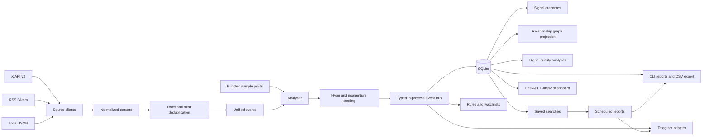

# Architecture

`x-narrative-tracker` is a local-first Python application. A single process can ingest content, analyze it, create signals, persist state, and serve the dashboard. SQLite is the system of record; derived graph, quality, and outcome tables remain in the same database.

## Modules

| Area | Primary modules | Responsibility |
| --- | --- | --- |
| Configuration | `app/config.py`, `app/version.py` | Environment parsing, validation, paths, canonical version |
| Sources | `app/sources/`, `app/ingestion/` | X, RSS, Atom, generic feed, and local JSON ingestion |
| Analysis | `app/ai/` | Deterministic mock classification and optional OpenAI reasoning |
| Scoring | `app/scoring/` | Hype, momentum, opportunities, outcomes, and quality calculations |
| Events | `app/events/` | Typed synchronous publish/subscribe flow and default subscribers |
| Persistence | `app/db/database.py` | Backward-compatible schema initialization and repository methods |
| Automation | `app/rules/`, `app/watchlists/` | Rule evaluation and focused signal associations |
| Analytics | `app/analytics/`, `app/graph/`, `app/quality/` | Historical reports, graph projections, and explainable quality metrics |
| Delivery | `app/alerts/`, `app/export/` | Telegram, console output, and deterministic CSV export |
| Web | `app/dashboard/` | Read-oriented dashboard and REST API over the existing database |
| Operations | `app/observability/`, `app/production.py` | Structured logs, health, metrics, snapshots, and production lifecycle |
| Search/report automation | `app/search/`, `app/reports/` | Allowlisted searches, atomic scheduling, delivery, and run history |

## Event Flow

The Event Bus is synchronous, typed, dependency-free, and in-process. `publish(event)` invokes subscribers in registration order. It is an internal decoupling mechanism, not a durable queue.

1. Ingestion normalizes source-specific records and groups duplicate coverage into unified events.
2. The analyzer emits token, narrative, sentiment, importance, and summary data.
3. Scoring creates a signal and publishes `SignalCreated`.
4. Default subscribers persist the signal, update performance, evaluate rules and watchlists, project graph and quality data, and optionally notify Telegram.
5. Mature signals are evaluated independently; a persisted outcome publishes `SignalEvaluated`.
6. The dashboard and reports read persisted records. They do not own ingestion or scoring.
7. Saved searches reuse repository and graph query paths. The scheduler atomically claims due reports, then publishes lifecycle events without coupling search execution to Telegram.

Source and graph events include `ContentFetched`, `ContentAccepted`, `ContentDeduplicated`, `UnifiedEventCreated`, `UnifiedEventUpdated`, `GraphUpdated`, and quality lifecycle events. AI reasoning publishes request, completion, failure, and fallback events without coupling the analyzer to Telegram or FastAPI.

Report automation adds `SavedSearchExecuted`, `ScheduledReportStarted`, `ScheduledReportCompleted`, `ScheduledReportFailed`, and `ScheduledReportDelivered`. The FastAPI lifespan hosts one lightweight polling thread; SQLite claim state prevents duplicate execution in the supported single-instance deployment.

## Persistence And Migrations

`Database.initialize()` creates missing tables, columns, indexes, and compatibility views without requiring users to delete an existing database. Schema changes are additive. Before upgrading, stop writers and copy the SQLite database plus its `-wal` and `-shm` files, if present. See [the release notes](releases/v1.0.0.md) for the v1 upgrade procedure.

## Runtime Boundaries

- **Stable:** local sample mode, mock AI, SQLite storage, reports, CSV export, dashboard/API, health endpoints, outcomes, graph, quality, rules, and watchlists.
- **Optional integrations:** X, OpenAI, Telegram, and live RSS require network access and their relevant configuration.
- **Experimental analytics:** heuristic momentum, relationship inference, signal quality, and outcome classification are decision-support signals, not financial predictions.
- **Deployment:** the Docker image runs one FastAPI process, an optional background tracker, and an optional report scheduler in the same container. Run one ingestion writer and one scheduler per SQLite volume.

## Extension Points

Future adapters can subscribe to typed events or read repository methods without changing analyzers and scorers. The current Event Bus does not guarantee replay, cross-process delivery, or exactly-once processing; a durable broker would be a separate deployment concern.
