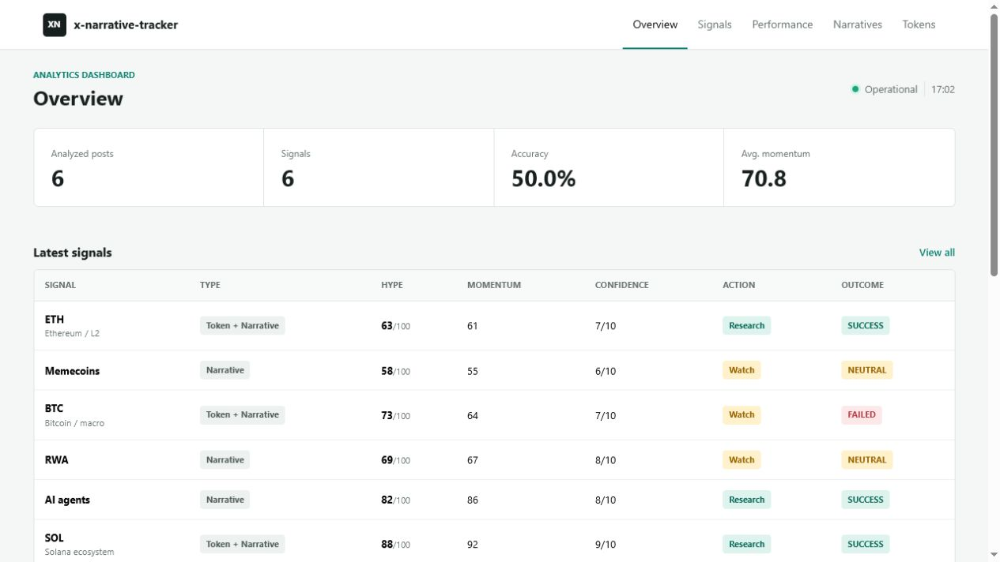
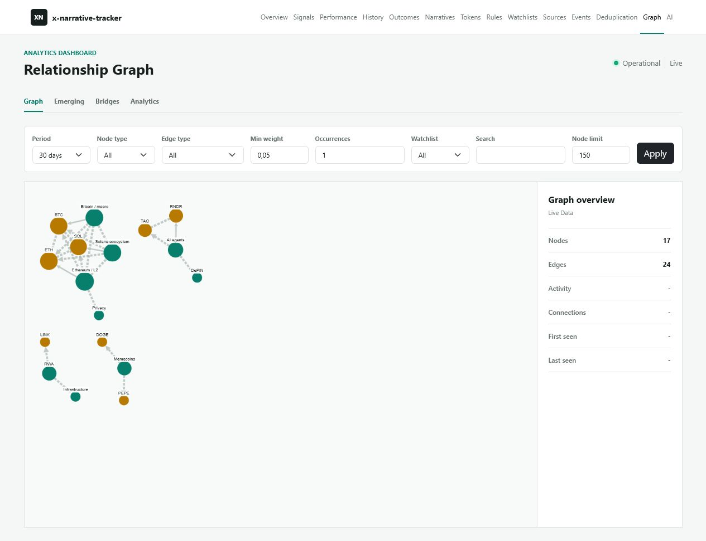

# Screenshots

The images in this repository are captured from the built-in FastAPI/Jinja2 dashboard using local SQLite data. They are product screenshots, not design mockups.

## Overview

The overview shows system status, recent signals, outcome accuracy, momentum, narratives, and tokens.

## Relationship Graph

The graph distinguishes observed relationships from optional AI-suggested edges and provides filtering and node detail views.

## Reproducing Screenshots

1. Run the [offline demo](demo.md) to populate a clean database.
2. Start `python -m app.main --dashboard --dashboard-host 127.0.0.1 --dashboard-port 8000`.
3. Capture `http://127.0.0.1:8000/` and `http://127.0.0.1:8000/graph` at a desktop viewport.
4. Check that no API keys, private chat identifiers, private source URLs, or personal data are visible.

Additional useful release captures are `/unified-events`, `/quality`, and `/system/health`. Only commit a new screenshot after verifying it was produced by the current application and contains safe fixture data.
